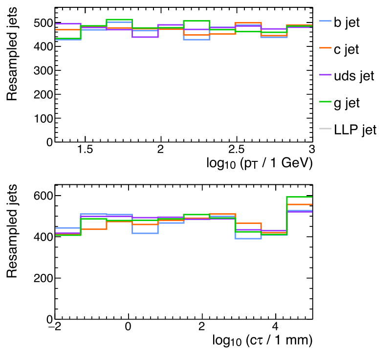

## Description

This repository contains a demonstration of a preprocessing pipeline that 
includes a direct interface to [ROOT TTrees](https://root.cern.ch/doc/master/classTTree.html), 
which was developed in the context of:

* CMS Collaboration, "Searching for new long-lived particle states decaying to 
jets using a deep neural network", (2019), (*paper in preparation*).


## Dependencies

* g++ 7.3
* Python 2.7
* ROOT 6
* TensorFlow >=1.4 (incompatible with 2.X)
* Keras >=2.1.5
* cmake 3 (for building only)

We recommend to use the provided miniconda environment, which can be installed with
```source Env/setupEnv.sh Env/environment.yml <install_directory>```. After
installation, the environment can be activated with ```source Env/env.sh```.


## Building the custom operations

The custom operations in ```Ops``` can be built using cmake as follows:

```
mkdir Ops/build
cd Ops/build
cmake .. -DCMAKE_INSTALL_PREFIX=$PWD/release
make install
```

Check if everything is working by running ```ctest``` from the build directory.

The following variables need to be set to use the created python package 
system-wide:

```
export PYTHONPATH=$PWD/release:$PYTHONPATH
export LD_LIBRARY_PATH=$PWD/release:$LD_LIBRARY_PATH
```

## Samples of QCD events

Files containing flat ROOT TTrees for testing the pipeline are available
in the ```Samples``` directory. These have been produced from the following
open dataset:

* CMS Collaboration, "Simulated dataset 
QCD_Pt-15to7000_TuneCUETP8M1_Flat_13TeV_pythia8 in MINIAODSIM format 
for 2016 collision data", CERN Open Data Portal (2019). 
[DOI:10.7483/OPENDATA.CMS.J52Q.4T4E](http://opendata.cern.ch/record/12021)


## Run the pipeline example


From the top-level directory of the repository run

```
python pipeline.py 
```

The pipeline will resample the jets to be uniformly in pT and |eta|. Additionally
random proper lifetime values are generated for the SM jets. Since the QCD sample 
above does not contain true LLP jets, the lifetime is drawn instead from a 
uniform distribution. The script will produce the following plot, which shows 
the resulting pT and lifetime distributions per jet class.




## Authors

Copyright 2019 Matthias Komm, Vilius Cepaitis, Robert Bainbridge, Alex Tapper, 
Oliver Buchmüller.

